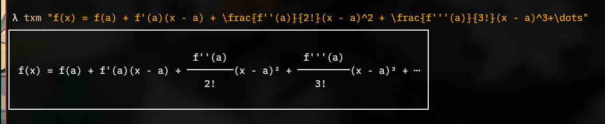
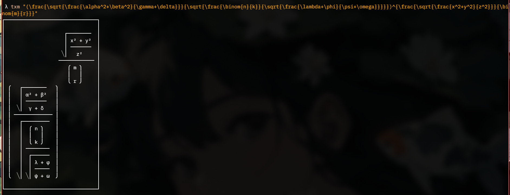

# TXM
TXM (Terminal TeX Math) is a math rendering engine with LaTeX support.

# Example:

## License
- Apache License, Version 2.0 ([LICENSE-APACHE](LICENSE-APACHE))
- MIT license ([LICENSE-MIT](LICENSE-MIT))
